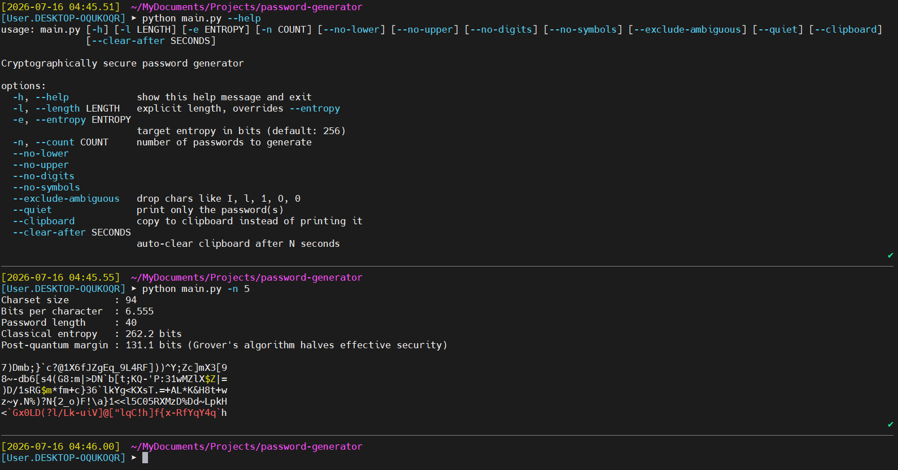

# Password Generator

A cryptographically secure password generator.



## How it works

1. **Charset construction**: builds a character set from the enabled classes (lowercase, uppercase, digits, symbols). `--exclude-ambiguous` strips visually confusable characters (`I`, `l`, `1`, `O`, `0`, etc.).
2. **Length from entropy**: computes `bits_per_char = log2(charset_size)`, then `length = ceil(target_entropy / bits_per_char)`. Default target: 256 bits.
3. **Character selection**: each character is drawn independently via `secrets.choice()`, Python's CSPRNG (backed by `os.urandom`). No pattern, no reuse of prior output, uniform over the charset.
4. **Post-quantum margin**: displays `entropy / 2`, since Grover's algorithm gives a quadratic speedup on brute-force search, halving effective security bits.
5. **Clipboard mode** (`--clipboard`): copies the password via `pyperclip` instead of printing it. `--clear-after N` wipes the clipboard after N seconds, but only if it still holds the password you generated (won't clobber something else you copied since).

## Usage

```bash
python main.py                          # 256-bit target, all character classes
python main.py -e 384 -n 5              # 5 passwords at 384-bit target
python main.py -l 32 --exclude-ambiguous
python main.py --clipboard --clear-after 20
```

## Installation

Prerequisites: Python 3.9+.

```bash
git clone https://github.com/p4p2r0/password-generator.git
cd password-generator
pip install -r requirements.txt
python main.py
```

## License

This project is licensed under the MIT License.
